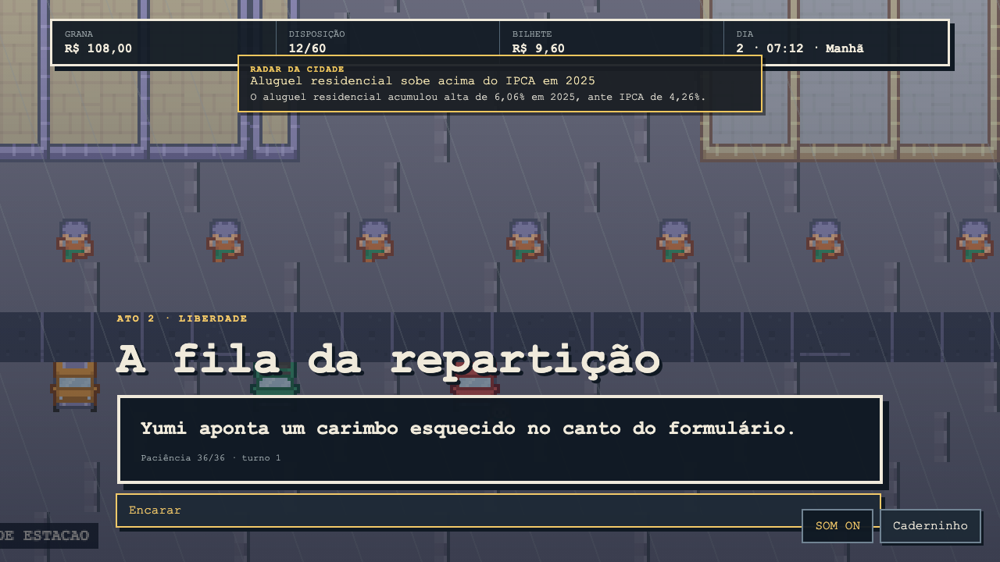
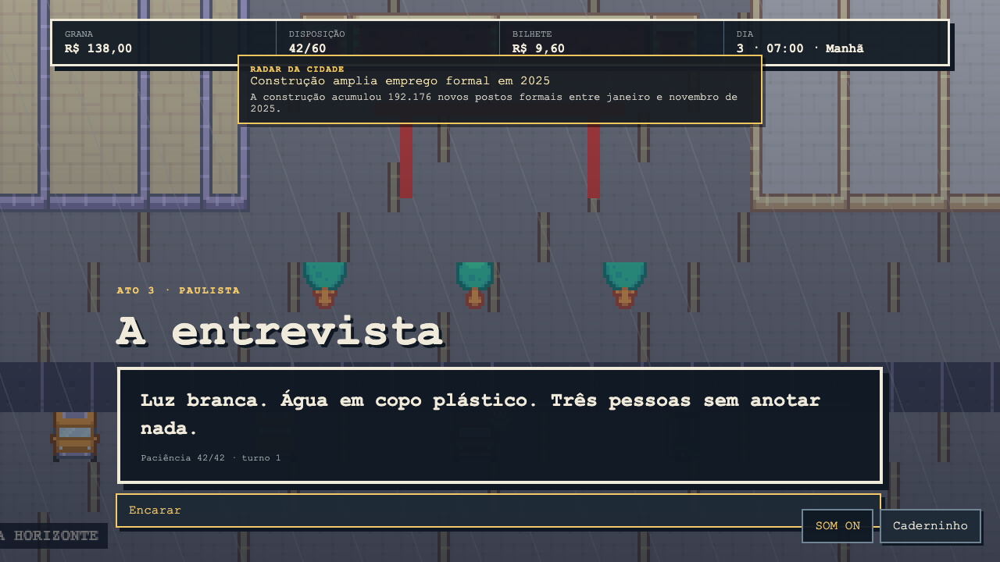
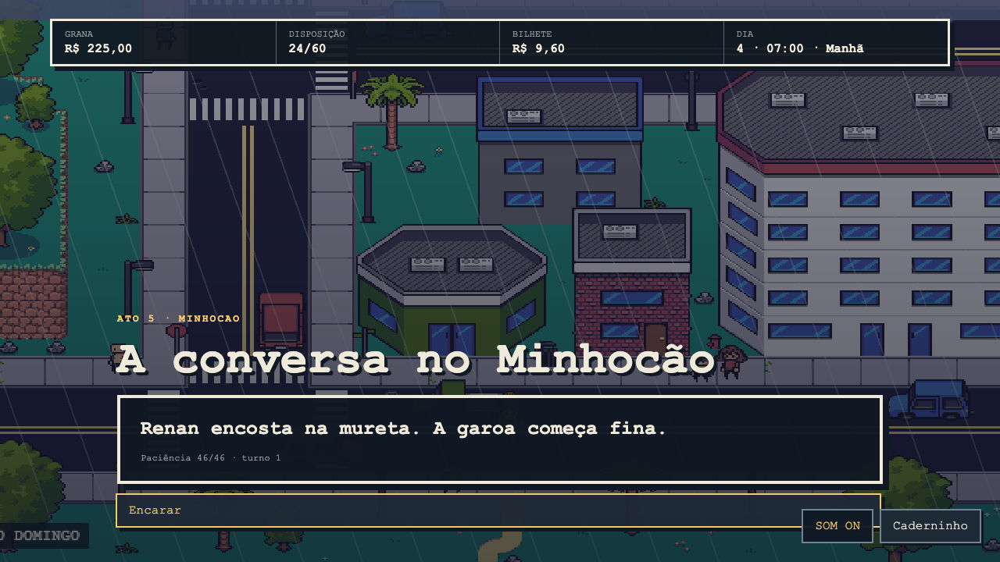

# GAROA

[](https://github.com/dexterorion/super-mmorpg/actions/workflows/ci.yml)
[](https://github.com/dexterorion/super-mmorpg/actions/workflows/e2e.yml)
[](https://github.com/dexterorion/super-mmorpg/actions/workflows/security.yml)

Um RPG 2D sobre chegar a São Paulo às 5h da manhã com R$ 340, o endereço de um primo desaparecido e nenhuma certeza de como a cidade funciona.


## Estado do jogo

A campanha narrativa atual, em cinco atos, é jogável do começo ao fim no navegador. Ela atravessa Tietê, Centro, Bixiga, Liberdade, Paulista, Zona Leste e Minhocão, com movimento top-down, colisões, NPCs, diálogos ramificados, transporte público, saves, Caderninho e seis **Desenrolos** — conflitos por argumentação em que o adversário é uma situação, nunca uma pessoa. Música procedural, garoa, tráfego e efeitos reagem ao bairro, período e modo de jogo.

Uma escolha na Horizonte Urbano e o destino de Val formam quatro finais distintos.

O arco de campanha não é o limite planejado do projeto. O “jogo da vida” aberto — estudar, mudar de moradia, construir família e atravessar conjunturas econômicas durante anos — continua em evolução.

| Sistema                                            | Estado atual                                                           |
| -------------------------------------------------- | ---------------------------------------------------------------------- |
| Campanha de cinco atos e quatro finais             | Jogável e coberta por playtest automatizado                            |
| Exploração, colisões, NPCs e oito mapas distritais | Jogável                                                                |
| Arquétipos, aluguel, renda e deslocamento          | Jogável                                                                |
| Matrícula e progressão educacional desigual        | Integrada ao estado, sessão, Caderninho e saves                        |
| Parceria, casamento, filhos e trabalho de cuidado  | Motor de regras e persistência prontos; conteúdo narrativo em expansão |
| Conjuntura econômica e social de longo prazo       | Em integração ao loop jogável                                          |
| Agenda, trabalho, carreira e mudança de moradia    | Tracer anual jogável; conteúdo narrativo em expansão                   |

O conteúdo está em pt-BR. Código, identificadores e documentação técnica usam inglês.

## Jogar localmente

Requisitos: Node.js 22 ou 24 e npm.

```bash
npm ci
npm run art:build
npm run dev
```

Abra `http://localhost:5173`. Use setas ou WASD para navegar, Enter/Espaço para escolher, Esc para abrir o Caderninho e F3 para o overlay de debug. Mouse e gamepad também são aceitos.

O áudio começa após a primeira interação, como exigido pelos navegadores. O botão `SOM ON/OFF` controla música, ambiência e efeitos em conjunto.

## Screenshots

Capturas atualizadas em 9 de agosto de 2026 pelo playthrough automatizado da versão
atual. As imagens abaixo são renderizações reais do jogo em 1280×720, não mockups.

| Título                                | Desenrolo                                    |
| ------------------------------------- | -------------------------------------------- |
|  |  |

| Chegada                                  | Caderninho e saves                             |
| ---------------------------------------- | ---------------------------------------------- |
|  |  |

| Exploração top-down                             | NPC no Anhangabaú                |
| ----------------------------------------------- | -------------------------------- |
|  |  |

| Enchente na Zona Leste                     | Final no Minhocão                     |
| ------------------------------------------ | ------------------------------------- |
|  |  |

| Repartição                                     | Entrevista                                     |
| ---------------------------------------------- | ---------------------------------------------- |
|  |  |

| Minhocão                                   |
| ------------------------------------------ |
|  |

Para regenerar as capturas, execute `npm run playtest:visual`, inspecione os 11 PNGs em `playtest-report/screenshots/` e copie as versões aprovadas para `docs/screenshots/`. Capturas visuais não devem ser publicadas sem inspeção humana ou visual do resultado.

O [scorecard visual](docs/VISUAL_SCORECARD.md) define as cenas canônicas, o
baseline reproduzível, os gates objetivos e a rubrica humana usada para decidir
se uma mudança realmente melhora o jogo.

## Arquitetura

O jogo tem uma única API de regras: `GameSession`. Phaser e o bot headless consultam `availableActions(state)` e executam `perform(state, action)`. Assim, um caminho que o bot testa é o mesmo caminho usado pelo jogador.

```text
core (TypeScript puro) ← content (dados)
        ↑
engine + platform + observability
        ↑
Phaser / Playwright / bot headless
```

- `src/core/`: estado imutável, economia, diálogos, Desenrolo, RNG e saves.
- `src/content/`: mundo e história como dados validados por Zod.
- `src/engine/`: apresentação Phaser, sem regras de jogo.
- `tools/art/`: atlas determinístico de elementos paulistanos complementares.
- `public/assets/kenney-rpg-urban/`: cidade e personagens CC0 na mesma grade visual.
- `public/assets/fisherg-city/`: base urbana CC0 anterior, mantida como referência.
- `tools/playtest/`: bot headless e playthrough visual.
- `docs/screenshots/`: capturas reais produzidas pelo playthrough.

## Qualidade

```bash
npm run typecheck
npm run lint
npm run format:check
npm run test:coverage
npm run art:build
npm run playtest -- --runs 1000
npm run playtest:life
npm run playtest:visual
npm run build
```

`npm run verify` executa as verificações rápidas sem o Playwright. Os workflows [CI](https://github.com/dexterorion/super-mmorpg/actions/workflows/ci.yml), [E2E](https://github.com/dexterorion/super-mmorpg/actions/workflows/e2e.yml) e [Security](https://github.com/dexterorion/super-mmorpg/actions/workflows/security.yml) repetem a validação no GitHub Actions.

O histórico de rodadas e correções está em [PLAYTEST_LOG.md](PLAYTEST_LOG.md). Para contribuir, consulte [CONTRIBUTING.md](CONTRIBUTING.md).
O desenvolvimento em andamento pode ser acompanhado nas [GitHub Issues](https://github.com/dexterorion/super-mmorpg/issues).

## Princípios do jogo

- Perder um Desenrolo muda o caminho; nunca gera “game over”.
- Dinheiro é inteiro em centavos e todo acaso usa RNG semeado.
- Aprender a cidade aumenta **Manha**; não existe XP por derrotar pessoas.
- Texto curto: até 90 caracteres por balão e seis balões antes de devolver controle.
- Telemetria é desligada por padrão e não coleta PII.

GAROA é um projeto autoral, atualmente sem licença para redistribuição.

## Créditos de arte

Cidade, veículos e personagens agora usam o **RPG Urban Pack**, de Kenney,
distribuído em CC0. O pack FisherG anterior também permanece preservado como
referência CC0. As licenças acompanham os arquivos; chuva, paleta, sinalização e
elementos específicos de São Paulo são adaptações do projeto GAROA.
