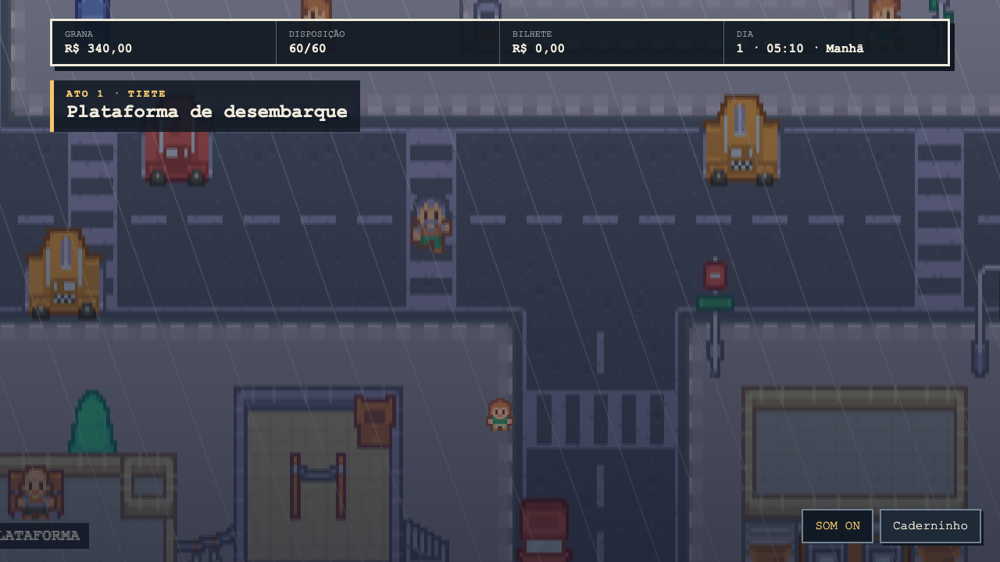
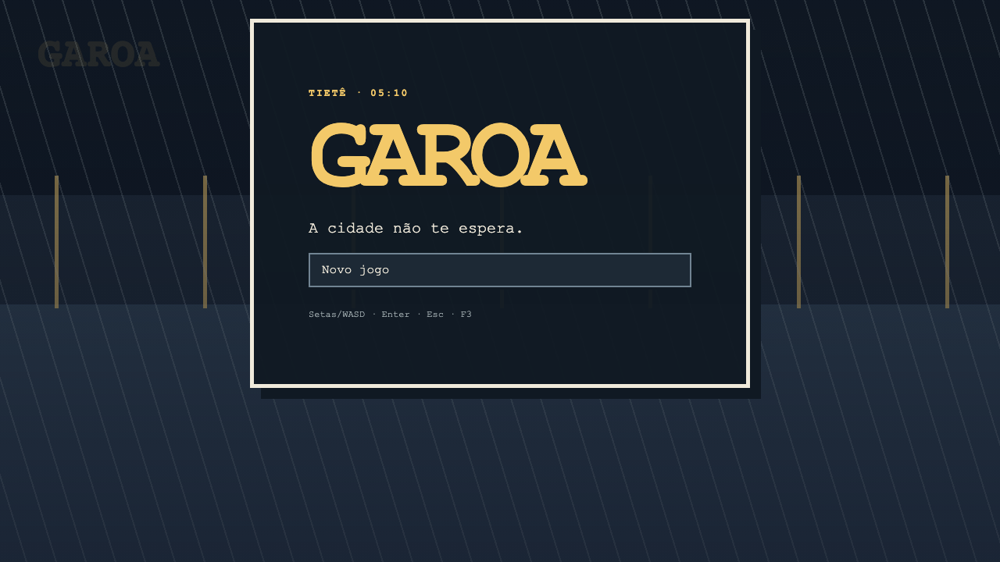
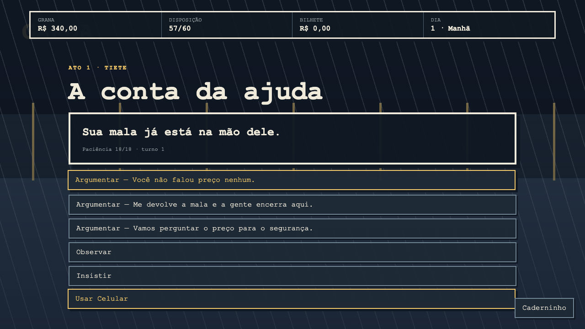
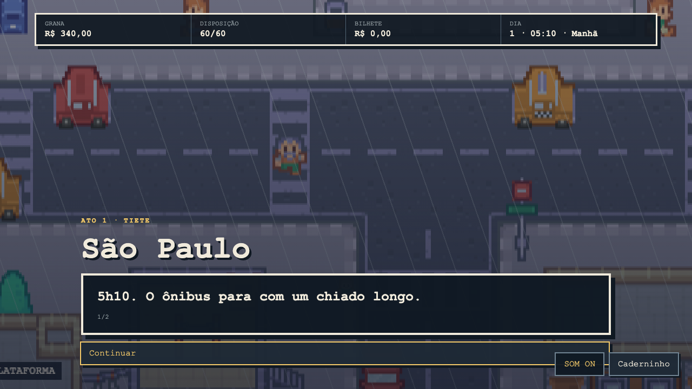
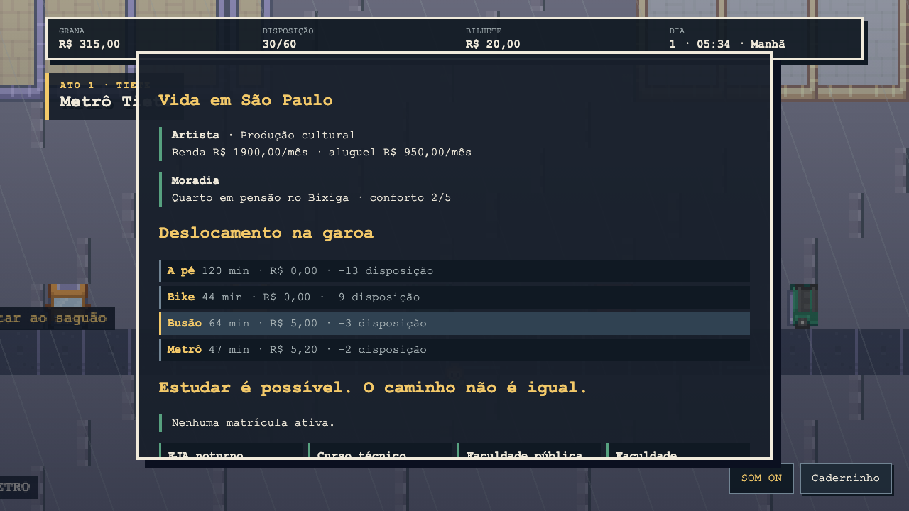
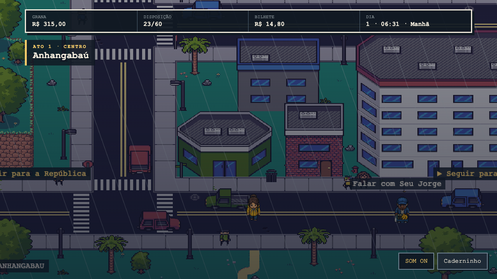
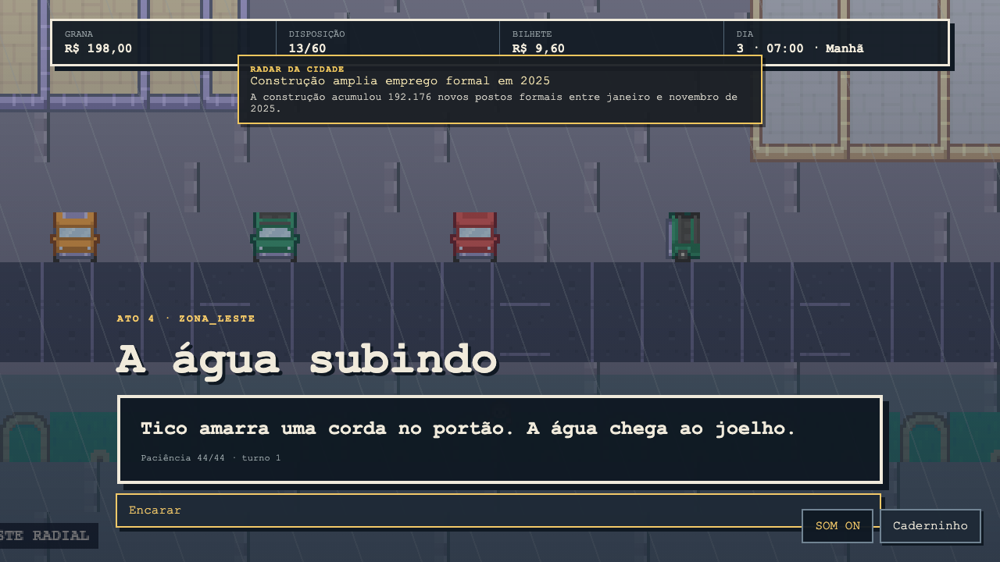
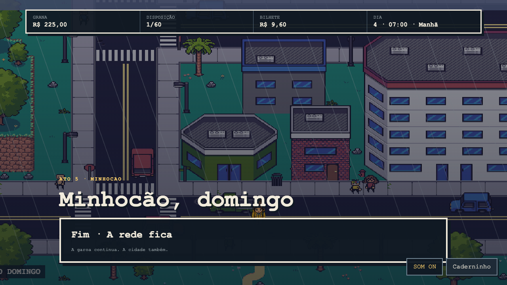

# GAROA

Um RPG 2D sobre chegar a São Paulo às 5h da manhã com R$ 340, o endereço de um primo desaparecido e nenhuma certeza de como a cidade funciona.



## Estado do jogo

A campanha completa, em cinco atos, é jogável do começo ao fim no navegador. Ela atravessa Tietê, Centro, Bixiga, Liberdade, Paulista, Zona Leste e Minhocão, com diálogos ramificados, transporte público, saves, Caderninho e seis **Desenrolos** — conflitos por argumentação em que o adversário é uma situação, nunca uma pessoa. Música procedural, garoa, tráfego e efeitos reagem ao bairro, período e modo de jogo.

Uma escolha na Horizonte Urbano e o destino de Val formam quatro finais distintos.

O conteúdo está em pt-BR. Código, identificadores e documentação técnica usam inglês.

## Jogar localmente

Requisitos: Node.js 22 ou 24 e npm.

```bash
npm ci
npm run art:build
npm run dev
```

Abra `http://localhost:5173`. Use setas ou WASD para navegar, Enter/Espaço para escolher, Esc para abrir o Caderninho e F3 para o overlay de debug. Mouse e gamepad também são aceitos.

O áudio começa após a primeira interação, como exigido pelos navegadores. O botão `SOM ON/OFF` controla música, ambiência e efeitos em conjunto.

## Screenshots

| Título                                | Desenrolo                                    |
| ------------------------------------- | -------------------------------------------- |
|  |  |

| Chegada                                  | Caderninho e saves                             |
| ---------------------------------------- | ---------------------------------------------- |
|  |  |

| Exploração top-down                             | NPC no Anhangabaú                |
| ----------------------------------------------- | -------------------------------- |
|  |  |

| Enchente na Zona Leste                     | Final no Minhocão                     |
| ------------------------------------------ | ------------------------------------- |
|  |  |

## Arquitetura

O jogo tem uma única API de regras: `GameSession`. Phaser e o bot headless consultam `availableActions(state)` e executam `perform(state, action)`. Assim, um caminho que o bot testa é o mesmo caminho usado pelo jogador.

```text
core (TypeScript puro) ← content (dados)
        ↑
engine + platform + observability
        ↑
Phaser / Playwright / bot headless
```

- `src/core/`: estado imutável, economia, diálogos, Desenrolo, RNG e saves.
- `src/content/`: mundo e história como dados validados por Zod.
- `src/engine/`: apresentação Phaser, sem regras de jogo.
- `tools/art/`: personagens e elementos paulistanos gerados de forma determinística.
- `public/assets/fisherg-city/`: tiles urbanos CC0 usados como base dos mapas.
- `tools/playtest/`: bot headless e playthrough visual.
- `docs/screenshots/`: capturas reais produzidas pelo playthrough.

## Qualidade

```bash
npm run typecheck
npm run lint
npm run format:check
npm run test:coverage
npm run art:build
npm run playtest -- --runs 1000
npm run playtest:visual
npm run build
```

`npm run verify` executa as verificações rápidas sem o Playwright. Os workflows CI, E2E e Security repetem a validação em GitHub Actions.

O histórico de rodadas e correções está em [PLAYTEST_LOG.md](PLAYTEST_LOG.md). Para contribuir, consulte [CONTRIBUTING.md](CONTRIBUTING.md).

## Princípios do jogo

- Perder um Desenrolo muda o caminho; nunca gera “game over”.
- Dinheiro é inteiro em centavos e todo acaso usa RNG semeado.
- Aprender a cidade aumenta **Manha**; não existe XP por derrotar pessoas.
- Texto curto: até 90 caracteres por balão e seis balões antes de devolver controle.
- Telemetria é desligada por padrão e não coleta PII.

GAROA é um projeto autoral, atualmente sem licença para redistribuição.

## Créditos de arte

Os mapas urbanos reutilizam e adaptam o pack **12×12 City Tiles — Top Down**, de
FisherG, distribuído em CC0. A cópia da licença original acompanha os arquivos em
`public/assets/fisherg-city/LICENSE.txt`. Chuva, paleta, sinalização, personagens e
elementos específicos de São Paulo são adaptações do projeto GAROA.
