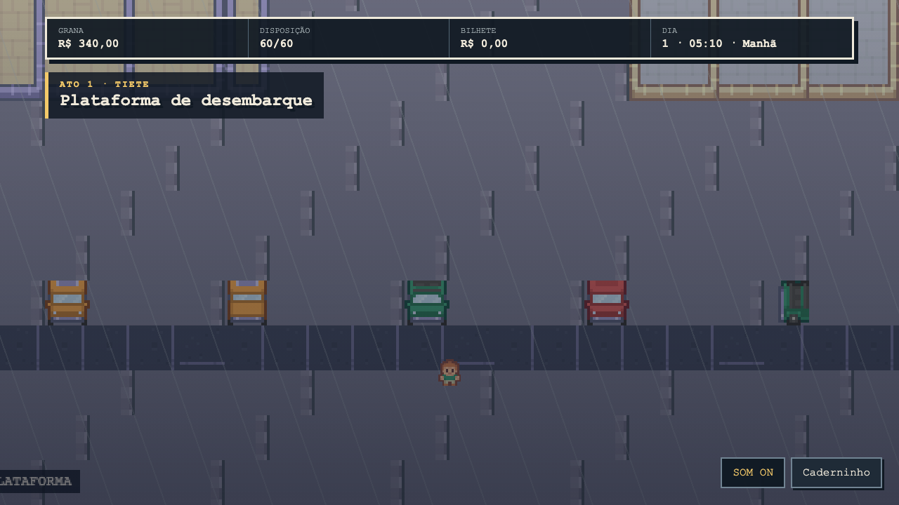
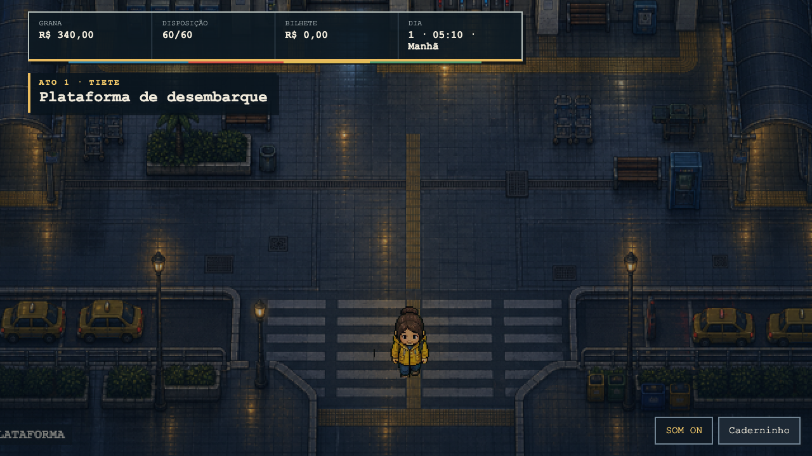
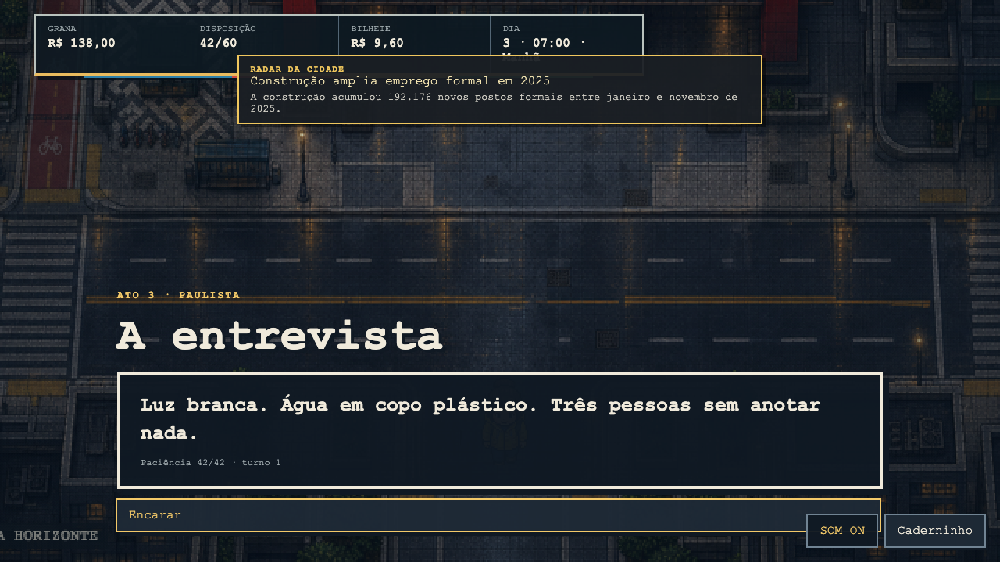
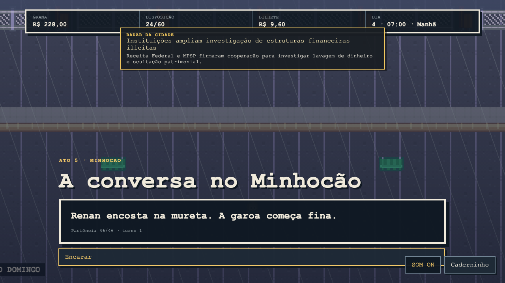

# Propagação visual por distrito

Este relatório acompanha a aplicação da direção **centro molhado sob luz de
sódio** aos distritos do GAROA. As notas são autoavaliações provisórias de um
revisor; o release continua exigindo a revisão independente definida em
`VISUAL_SCORECARD.md`.

## Lote 1 — Tietê, Paulista e Minhocão

### Tietê — terminal intermodal às 05:10

| Antes                                             | Depois                                            |
| ------------------------------------------------- | ------------------------------------------------- |
|  |  |

O terminal é construído por cobertura modernista, vidro, faixa tátil, plataformas,
carrinhos, bancos, drenagem, travessia e táxis. O percurso inferior continua
aberto e os volumes laterais comunicam as colisões.

| Eixo                           |     Nota |
| ------------------------------ | -------: |
| Identidade paulistana          |     4,10 |
| Coerência personagens/ambiente |     4,00 |
| Composição e hierarquia        |     4,20 |
| Densidade e variedade          |     4,40 |
| Movimento e vida urbana        |     3,25 |
| Legibilidade e acessibilidade  |     3,75 |
| Acabamento e consistência      |     4,00 |
| **Média ponderada**            | **4,00** |

### Paulista — MASP e avenida molhada

| Antes                                                   | Depois                                                  |
| ------------------------------------------------------- | ------------------------------------------------------- |
|  |  |

O vão do MASP, estrutura vermelha, calçada portuguesa, ciclovia, abrigo de ônibus
e avenida formam o lugar. É o resultado com menor margem do lote: o diálogo e o
radar encobrem parte do marco arquitetônico durante a entrevista.

| Eixo                           |     Nota |
| ------------------------------ | -------: |
| Identidade paulistana          |     4,25 |
| Coerência personagens/ambiente |     4,00 |
| Composição e hierarquia        |     3,75 |
| Densidade e variedade          |     4,25 |
| Movimento e vida urbana        |     3,25 |
| Legibilidade e acessibilidade  |     3,50 |
| Acabamento e consistência      |     3,75 |
| **Média ponderada**            | **3,88** |

### Minhocão — tabuleiro elevado de domingo

| Antes                                                   | Depois                                                  |
| ------------------------------------------------------- | ------------------------------------------------------- |
|  |  |

Parapeitos, acessos, edifícios e ruas abaixo deixam clara a cota elevada. Marcas
de pista, canteiros comunitários, bancos, barras, bicicletas e vagas de ambulante
comunicam o uso de parque sem apagar a infraestrutura viária.

| Eixo                           |     Nota |
| ------------------------------ | -------: |
| Identidade paulistana          |     4,25 |
| Coerência personagens/ambiente |     4,00 |
| Composição e hierarquia        |     4,00 |
| Densidade e variedade          |     4,00 |
| Movimento e vida urbana        |     3,25 |
| Legibilidade e acessibilidade  |     3,50 |
| Acabamento e consistência      |     3,75 |
| **Média ponderada**            | **3,88** |

## Estado da propagação

| Distrito   | Nota provisória | Estado                    |
| ---------- | --------------: | ------------------------- |
| Centro     |            3,99 | passa                     |
| Tietê      |            4,00 | passa                     |
| Paulista   |            3,88 | passa com margem estreita |
| Minhocão   |            3,88 | passa com margem estreita |
| Bixiga     |               — | pendente                  |
| Liberdade  |               — | pendente                  |
| Zona Leste |               — | pendente                  |
| Ibirapuera |               — | pendente                  |

O ticket permanece aberto até os quatro distritos pendentes passarem. O próximo
lote deve também procurar uma captura de Paulista que exponha melhor o MASP, sem
alterar artificialmente a nota deste estado.

## Produção

Os backdrops `tiete.png`, `paulista.png` e `minhocao.png`, em
`public/assets/garoa-city/`, foram gerados com a ferramenta de imagens da OpenAI.
O prompt comum fixou pixel art top-down, 768×480 final, a paleta e a densidade do
slice do Centro; cada variação especificou arquitetura, circulação e mobiliário
locais. Foram proibidos personagens, texto, interface, marcas, chuva embutida,
antialiasing e perspectiva isométrica.
