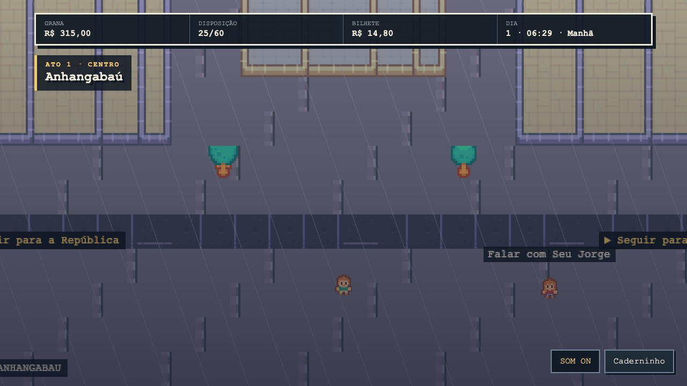
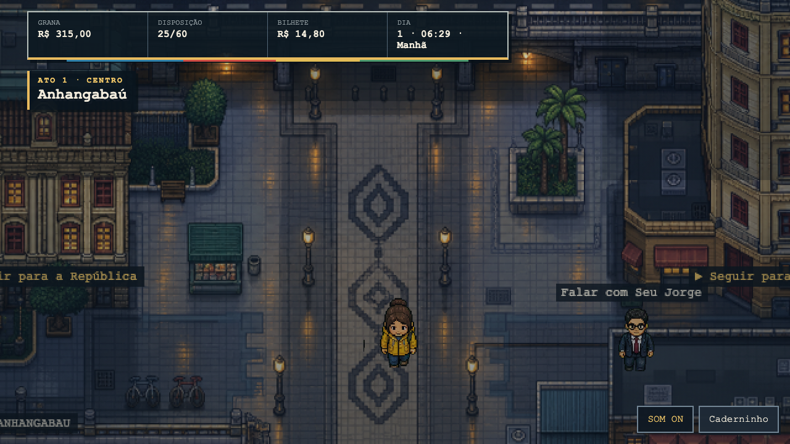

# Vertical slice visual — Centro

O slice transforma o Anhangabaú na referência visual dos próximos distritos. A
direção é **centro molhado sob luz de sódio**: concreto frio, pavimento escuro,
fachadas ocupadas e pontos quentes refletidos pela garoa. O risco deliberado é
usar o Viaduto do Chá e o mosaico do calçadão como composição, não como placa.

## Antes e depois

| Baseline `e8ad704`                                  | Vertical slice                                      |
| --------------------------------------------------- | --------------------------------------------------- |
|  |  |

O “antes” é a captura canônica publicada antes desta investigação. O “depois”
foi produzido pelo mesmo roteiro real do Playwright, em Chromium 1280×720.

## Tokens reutilizáveis

| Papel             | Token     | Uso                                        |
| ----------------- | --------- | ------------------------------------------ |
| Asfalto molhado   | `#151f2b` | ruas, sombras e base de contraste          |
| Concreto azul     | `#536675` | fachadas, pontes e mobiliário              |
| Pedra clara       | `#c7c2ad` | calçada, bordas e hierarquia               |
| Luz de sódio      | `#e9bb5e` | focos, reflexos e estado ativo             |
| Folhagem escura   | `#31504e` | massa vegetal sem competir com personagens |
| Vermelho de freio | `#b9544b` | detalhes urbanos pontuais                  |

Regras derivadas:

- Personagem e NPC ocupam aproximadamente uma célula de 64 px na tela e usam o
  mesmo nível de detalhe do cenário; sombras de contato preservam o chão.
- Toda cena exterior tem arquitetura, circulação e mobiliário. O caminho central
  permanece aberto e colisões coincidem com massas construídas visíveis.
- Profundidade vem de três planos: fachadas/viaduto, percurso e objetos de
  primeiro plano. Detalhe não pode virar ruído na rota jogável.
- A garoa se move em camada própria; iluminação fica no cenário para permitir
  reflexos localizados sem lavar toda a paleta.
- O HUD ocupa só o quadrante superior esquerdo, usa a linha multicolorida do
  transporte como assinatura e deixa o mundo respirar.
- O nome do lugar confirma a leitura arquitetônica; não é responsável por criá-la.

## Avaliação provisória

Esta é uma autoavaliação de um revisor, não a revisão de três pessoas exigida
para o release. As notas seguem exatamente os pesos de `VISUAL_SCORECARD.md`.

| Eixo                           |    Antes |   Depois | Evidência do depois                                                                                     |
| ------------------------------ | -------: | -------: | ------------------------------------------------------------------------------------------------------- |
| Identidade paulistana          |     1,00 |     4,25 | Viaduto, calçadão, fachadas, banca, bicicletário, drenagem e iluminação formam o lugar antes do título. |
| Coerência personagens/ambiente |     1,25 |     4,00 | Sprites GAROA compartilham contorno, detalhe, sombra e temperatura do cenário.                          |
| Composição e hierarquia        |     2,25 |     4,00 | Eixo central conduz ao viaduto; HUD e rótulo ficam fora da rota principal.                              |
| Densidade e variedade          |     1,25 |     4,50 | Três planos e mais de oito famílias de elementos sem repetir um único prop dominante.                   |
| Movimento e vida urbana        |     1,00 |     3,25 | Chuva animada, luzes e mobiliário sugerem atividade; ainda faltam pedestres e trânsito sistêmicos.      |
| Legibilidade e acessibilidade  |     2,50 |     3,75 | HUD mais compacto e contraste forte; auditoria WCAG automatizada ainda é trabalho posterior.            |
| Acabamento e consistência      |     2,25 |     3,75 | Escala e luz ficaram coesas; os demais distritos ainda não têm a mesma fidelidade.                      |
| **Média ponderada**            | **1,61** | **3,99** | Supera 3,80, nenhum eixo abaixo de 3 e identidade acima de 4.                                           |

O slice atinge os limiares humanos de forma provisória. Não declara o jogo
aprovado: faltam revisão independente de três pessoas, gates objetivos
automatizados e propagação coerente para os outros distritos.

## Produção e proveniência

O backdrop `public/assets/garoa-city/centro-anhangabau.png` foi gerado com a
ferramenta de imagens da OpenAI e integrado como asset 768×480. O prompt pediu
pixel art top-down 16-bit, eixo do Vale do Anhangabaú, Viaduto do Chá, fachadas
históricas, pavimento molhado, banca, bicicletário, drenagem e postes; proibiu
personagens, texto, HUD, marcas, chuva embutida, antialiasing e perspectiva
isométrica. O pack Kenney foi referência de escala e linguagem, não imagem-alvo.
